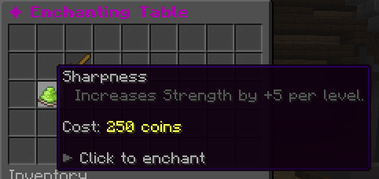
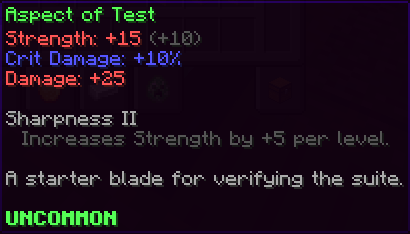
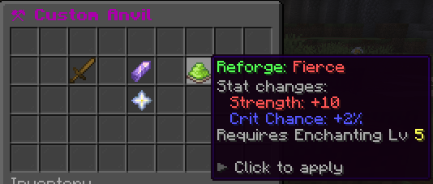

# Enchanting (`rpg-enchanting`)

> **Status:** Working (v0.4.0+) — Custom enchants, reforges, and item upgrades all functional. Reforge stones and upgrade books are physical items applied in the anvil GUI. Enchant descriptions render in item lore. GUIs open from custom enchanting/anvil blocks (admins must copy `blocks-example.yml` into `plugins/rpg-core/blocks/`). Vanilla enchanting-table + anvil + smithing-table outputs suppressed. Minecraft XP cost for enchanting is planned but not yet wired (see [todo-improvements](../planned/todo-improvements.md)).

One addon bundling four related "improve your gear" features. Each sub-feature is individually toggleable.

## Design intent

Enchants, reforges, and upgrades are three separate systems intentionally: **enchants** are tiered per-slot progressions that build up over time (you apply more, you get stronger); **reforges** are identity modifiers — one per item, they define the item's archetype (a "Sharp" sword vs a "Heavy" one); **upgrades** are consumable stacks that compound a single progression path. Keeping them separate means players make meaningful choices about *how* to develop an item rather than just piling on buffs.

1. **Enchanting skill** — XP from applying enchants
2. **Enchanting mechanic** — custom enchants applied at a custom enchanting block
3. **Reforge mechanic** — apply a reforge to an item for stat bundles (random or via consumable stones)
4. **Item upgrades** — apply `UPGRADE`-type items via a custom anvil block

Vanilla enchanting tables and anvils are cancelled (per [vanilla suppression](../core/vanilla-suppression.md)).

## Config

`plugins/rpg-enchanting/config.yml`:

```yaml
# Per-feature toggles.
features:
  enchanting: true
  reforges: true
  upgrades: true

# Station block IDs to listen on (legacy — prefer setting StationType in block YAML instead).
stations:
  enchanting-block: rpg_enchanting_table
  anvil-block: rpg_custom_anvil

# Whether to also intercept the vanilla enchanting table / anvil (default true).
intercept-vanilla-enchanting: true
intercept-vanilla-anvil: true

# Skill XP awarded on successful operation.
xp:
  per-enchant: 25
  per-reforge: 15
  per-upgrade: 40

# Whether enchants/reforges/upgrades require currency in addition to materials.
charge-currency: true

# Mirror of rpg-core vanilla-suppression flags (convenience overrides).
suppress:
  enchanting-table: true
  anvil: true
```

## Custom enchants

Files under `plugins/rpg-enchanting/enchants/<file>.yml`.

Enchants fall into four patterns — they can be mixed on a single enchant:

| Pattern | What it does | How |
|---|---|---|
| **Stat enchant** | Adds stats to the item while equipped | `levels: N: { stats: { stat_id: value } }` |
| **Proc enchant** | Fires an ability at a % chance on a trigger | `levels: N: { triggers: [{ event: on_hit, chance: 10, ability: some_ability }] }` — requires Ability Trigger Types feature |
| **Ability enchant** | Grants or replaces an ability on the item | `levels: N: { abilities: [fireball{}] }` |
| **Utility enchant** | Changes a gameplay flag (infinite ammo, etc.) | Not yet wired — planned |

{ .screenshot }

### Stat enchant example

```yaml
sharpness:
  display: "&7Sharpness"
  applies-to: [SWORD]
  max-level: 5
  levels:
    1: { stats: { strength: 5 } }
    2: { stats: { strength: 12 } }
    3: { stats: { strength: 20 } }
    4: { stats: { strength: 30 } }
    5: { stats: { strength: 42 } }
  apply-requirements:
    enchanting-level: 0          # min enchanting skill level to apply
  conflicts: []                  # list of enchant IDs that cannot coexist with this one
```

### Ability enchant example

Grants an ability directly on the item. Higher levels upgrade the ability's parameters. The ability fires with the item's default trigger (right-click for swords/wands, on-fire for bows).

```yaml
flame_blade:
  display: "&cFlame Blade"
  applies-to: [SWORD]
  max-level: 3
  levels:
    1:
      abilities:
        - "projectile{speed=1.5, particle=FLAME, damage_multiplier=0.5}"
    2:
      abilities:
        - "projectile{speed=2.0, particle=FLAME, damage_multiplier=0.8}"
    3:
      abilities:
        - "projectile{speed=2.5, particle=FLAME, damage_multiplier=1.2} apply_status{id=burn, duration=60}"
```

{ .screenshot }

> Ability enchants **replace** any ability granted by the previous level of the same enchant — they do not stack. If you want the enchant to add a second ability on top of the item's existing ones, reference the item's original ability ID in the lower-level entries too.

---

### Proc enchant example

> ⚠️ **Proc enchants (`triggers:`) are not yet functional.** The `triggers:` field is parsed but the Custom Enchantment Ability Triggers system (item 39 in [todo.md](../planned/todo.md)) is not yet implemented. Define proc enchants now for future compatibility, but they will not fire until that feature ships.

```yaml
thunderstrike:
  display: "&eThunderstrike"
  applies-to: [SWORD, AXE]
  max-level: 3
  levels:
    1: { triggers: [{ event: on_hit, chance: 5,  ability: lightning_strike }] }
    2: { triggers: [{ event: on_hit, chance: 10, ability: lightning_strike }] }
    3: { triggers: [{ event: on_hit, chance: 15, ability: lightning_strike }] }
  conflicts: []
```

### Conflict example — fire and frost enchants cannot coexist

```yaml
fire_aspect:
  display: "&cFire Aspect"
  applies-to: [SWORD]
  max-level: 2
  levels:
    1: { triggers: [{ event: on_hit, chance: 100, ability: apply_fire }] }
    2: { triggers: [{ event: on_hit, chance: 100, ability: apply_fire_strong }] }
  conflicts: [frost_aspect]      # prevents both being on the same item

frost_aspect:
  display: "&bFrost Aspect"
  applies-to: [SWORD]
  max-level: 2
  levels:
    1: { triggers: [{ event: on_hit, chance: 100, ability: apply_slow }] }
    2: { triggers: [{ event: on_hit, chance: 100, ability: apply_slow_strong }] }
  conflicts: [fire_aspect]
```

## Reforges

Files under `plugins/rpg-enchanting/reforges/<file>.yml`. A reforge replaces any existing reforge on the item and shows as a colored prefix on the item name (e.g. `&7Sharp &fIron Sword`).

Reforges apply **flat stat modifiers** — the values are added to the item's effective stats regardless of rarity. Rarity-scaled reforges are not yet supported.

```yaml
# Offensive — boosts crits
sharp:
  display: "&7Sharp"
  applies-to: [SWORD]
  modes:
    pay-currency-random: true    # available at the enchanting station for currency (random reforge)
    stone: true                  # can also be applied via the physical reforge stone item
  stone-item-id: sharp_reforge_stone
  effect:
    stats:
      crit_chance: 5
      crit_damage: 10

# Offensive — raw damage
heavy:
  display: "&cHeavy"
  applies-to: [SWORD, AXE]
  modes:
    pay-currency-random: true
    stone: true
  stone-item-id: heavy_reforge_stone
  effect:
    stats:
      strength: 15
      crit_chance: -2

# Caster — magic + mana
arcane:
  display: "&5Arcane"
  applies-to: [WAND]
  modes:
    pay-currency-random: true
    stone: true
  stone-item-id: arcane_reforge_stone
  effect:
    stats:
      intelligence: 40
      max_mana: 100

# Defensive — survivability
fortified:
  display: "&6Fortified"
  applies-to: [ARMOR]
  modes:
    pay-currency-random: true
    stone: true
  stone-item-id: fortified_reforge_stone
  effect:
    stats:
      defense: 20
      max_health: 50
```

{ .screenshot }

The physical reforge stone items (e.g. `sharp_reforge_stone`) are `UPGRADE`-type items defined in your `items/` YAML — they appear in the anvil GUI alongside the target item. Use `/enchanting give reforge <id>` to hand them to players for testing.

## Upgrades

`UPGRADE`-type items, defined in normal `items/` YAML. See [items.md](../content/items.md#upgrade).

Applied via the anvil GUI: drop the target item + the upgrade item, click to consume the upgrade and apply its effect. `MaxStacks` per-target enforced.

## Custom station blocks

Both the enchanting station and anvil are custom blocks (define them in `blocks/`):

```yaml
custom_enchanting_table:
  MinecraftBlock: enchanting_table
  Toughness: 200
  Interactable: true
  StationType: enchanting
  Drops:
  - vanilla:enchanting_table 1

custom_anvil:
  MinecraftBlock: anvil
  Toughness: 300
  Interactable: true
  StationType: anvil
  Drops:
  - vanilla:anvil 1
```

## Commands

| Command | Permission | Notes |
|---|---|---|
| `/enchanting reload` | `rpg.enchanting.admin.reload` | Reloads all enchant/reforge YAML |
| `/enchanting list` | `rpg.enchanting.admin.list` | Lists all registered enchant/reforge IDs |
| `/enchanting give enchant <id>` | `rpg.enchanting.admin.give` | Gives a named enchant book |
| `/enchanting give reforge <id>` | `rpg.enchanting.admin.give` | Gives the named reforge stone item |
| `/enchanting give upgrade <id>` | `rpg.enchanting.admin.give` | Gives the named upgrade book item |

Station blocks open the enchanting/anvil GUIs on right-click. The commands are admin utilities.

## Stats

- `enchanting_wisdom` — XP bonus
- `enchanting_luck` — quality of random reforge / upgrade outcomes

## Related

- [Skills framework](../core/skills.md)
- [Items (UPGRADE)](../content/items.md#upgrade)
- [Blocks](../content/blocks.md)
- [Vanilla suppression](../core/vanilla-suppression.md)
