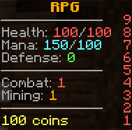

# HUD (`rpg-hud`)

> **Status:** In Progress — Scoreboard (sidebar), tablist (header/footer), action bar, and player nametags all live. Nametags use `TextDisplay` entities (not team scoreboards) — mounted as passengers above the player, position set via `Transformation` so the offset is accurate regardless of player height. `y-offset` is configurable. Placeholder resolution: `{name}`, `{prefix}`, `{suffix}`, `{health}`, `{max_health}`, `{mana}`, `{max_mana}`, `{coins}`, `{online}`, `{world}`, any stat by id, and `{skill:<id>:level|total_xp|to_next}`. Status-effect icons on nametags deferred to a polish slice.

Configurable scoreboard, tablist, action bar, and player nametags. All formats are templates with placeholders resolved by core's `MessageFormatter`.

{ .screenshot }

## Config

`plugins/rpg-hud/config.yml`:

```yaml
scoreboard:
  enabled: true
  title: "&6&lRPG"
  update-ticks: 10
  lines:
  - "&7&m                  "
  - "&7Health: &c{health}&7/&c{max_health}"
  - "&7Mana: &b{mana}&7/&b{max_mana}"
  - "&7Defense: &a{defense}"
  - "&7&m                  "
  - "&7Combat: &c{skill:combat:level}"
  - "&7Mining: &6{skill:mining:level}"
  - "&7&m                  "
  - "&e{coins}"

tablist:
  enabled: true
  update-ticks: 40
  header:
  - "&6&lRPG SERVER"
  - "&7Players online: &f{online}"
  footer:
  - "&7Combat: &c{skill:combat:level} &8| &7Mining: &6{skill:mining:level}"

action-bar:
  enabled: true
  update-ticks: 5
  idle-format: "&c❤ {health}/{max_health}  &b✦ {mana}/{max_mana}  &a✤ {defense}"

# Nametag above the player's head (TextDisplay entity). Hides when sneaking.
nametag:
  enabled: true
  format: "{prefix} {name} {suffix}"
  hide-when-sneaking: true
  y-offset: 0.5
  update-ticks: 10
```

## Placeholders

Same set as [chat](chat.md#placeholders) plus:

| Placeholder | Resolves to |
|---|---|
| `{max_health}` | Max RPG HP |
| `{defense}`, `{strength}`, etc. | Live stat values |
| `{online}` | Online player count |
| `{ping}` | Player ping |
| `{world}` | World name |
| `{skill:<id>:level}` | Skill level |
| `{skill:<id>:total_xp}` | Total accumulated skill XP |
| `{skill:<id>:to_next}` | XP needed to reach next level |

## Commands

| Command | Permission |
|---|---|
| `/hud toggle <scoreboard\|tablist\|actionbar>` | `rpg.hud.toggle` |
| `/hud reload` | `rpg.hud.reload` |

## Action bar priorities

The action bar shows one message at a time. When multiple sources want it, `RpgServices.actionBar()` priority messages (sent by combat, ability, and tool-gate code) display first; the idle HUD format resumes when no priority message is pending.

## Player join

On join, `HudService` builds the scoreboard, tablist, nametags. Updates tick at the configured rate.

## Related

- [Chat](chat.md) — `NameFormatter` shared
- [Vanilla suppression](../core/vanilla-suppression.md)
- [Stats reference](../stats.md)
