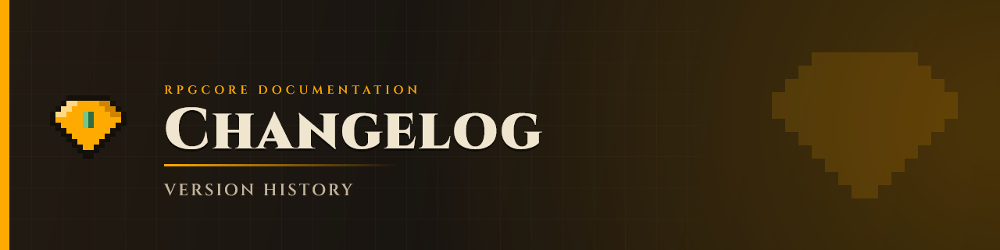

# Changelog

## How it works

Changelog pages are written **once per suite, at transition time** (when `suiteVersion` increments).
Each page is a short highlights list — new features, major fixes, new plugins — compiled from
`git log` at the moment the suite closes. There are no per-session or per-version-bump updates.

When `suiteVersion` goes from N → N+1:

1. Run `git log --oneline` since the last suite bump.
2. Pick 5–10 highlights (new systems, notable bug fixes, new plugins).
3. Write a summary at `docs/changelog/suite-<N>.md` and add a row to the table below.

---

## Suite history

| Suite | Status | Highlights |
|-------|--------|-----------|
| [21](changelog/suite-21.md) | **current** | `rpg-crafting`, `rpg-smelting`, mob death animation, timed smelting station |
| [20](changelog/suite-20.md) | closed | `rpg-homes`, `rpg-kits`, timed cooking/brewing, mob death anim, resource pack delivery, crafting/smelting extracted |
| [19](changelog/suite-19.md) | closed | Ability trigger system, 10 new effects, loot pools, enchanting XP cost, NPC overhaul, timed crafting |
| [18](changelog/suite-18.md) | closed | Per-player drops, global region, vanilla enchanting intercept, accessories, HUD effects placeholder |
| [16](changelog/suite-16.md) | closed | Initial ship — core pipeline, mining, combat, guilds, dungeons, NPCs, quests, HUD |

---

## Granular dev logs (archived)

The old per-session development logs are preserved for reference. They record every version bump
in detail but the format is retired — new entries are no longer added.

- [Suite 19 dev log](changelog/suite-19.md)
- [Suite 18 dev log](changelog/suite-18.md)
- [Suite 16 dev log](changelog/suite-16.md)
