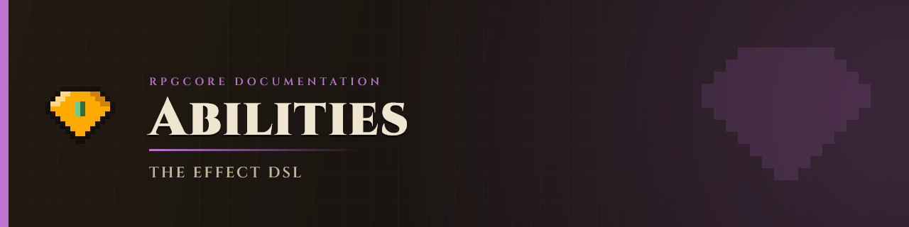

# Abilities

> **Status:** Working — Built-in effects library, custom ability YAML, full player trigger system (active click, passive proc, ticking passive), armor set ability bonuses, and mob ability triggers all implemented. Target selection effects (`nearest_enemy{}`, `farthest_enemy{}`, `nearest_ally{}`, `random_enemy{}`, `self{}`), conditional gates (`if_health_*`, `if_mana_*`, `if_marked{}`, `if_flag{}`, `if_not_flag{}`), and per-entity flags (`set_flag{}`, `clear_flag{}`) all implemented. Items and mobs share the same ability registry.

## Design intent

A sequence model is used instead of a monolithic "ability" type because **composability** lets you build complex behaviors from simple primitives without writing Java. A fireball is `projectile{} → explode{}`; a poison lance is `beam{} → apply_status{id=poison}`; a charge-up burst is `particles{} → delay{} → explode{}`. Each primitive does one thing and passes a shared context forward.

The ability system has two layers:

1. **Built-in effects** — primitive operations like `damage`, `explode`, `beam`, `heal`. Registered by `rpg-core` and addons. Invoked from item / mob YAML via the DSL.
2. **Custom abilities** — admin-authored YAML chains of built-in effects, defined under `plugins/rpg-core/abilities/`. Custom abilities can be invoked by their ID anywhere a built-in can.

---

## Triggers

### Player item triggers

Every entry in an item's `Abilities:` list can be bound to a specific **trigger** using the `~trigger ` prefix. Lines without a prefix default to `right_click` (backwards compatible with pre-trigger YAML).

| Trigger | Prefix | When it fires |
|---|---|---|
| `right_click` | _(default, no prefix)_ | Player right-clicks (air or block) |
| `left_click` | `~left_click ` | Player left-clicks |
| `shift_right_click` | `~shift_right_click ` | Player sneaks + right-clicks |
| `shift_left_click` | `~shift_left_click ` | Player sneaks + left-clicks |
| `on_hit` | `~on_hit ` | Player deals melee or projectile damage (after pipeline confirms hit) |
| `on_hurt` | `~on_hurt ` | Player receives damage (any source) |
| `on_jump` | `~on_jump ` | Player jumps |
| `on_attack` | `~on_attack ` | Player initiates an attack — fires before the damage pipeline, even if the hit is later cancelled |
| `on_kill` | `~on_kill ` | Player kills an RPG mob |
| `on_block` | `~on_block ` | Player is hit while holding a shield (`isBlocking()`); attacker is `ctx.target` |
| `on_login` | `~on_login ` | Fires once when the player joins the server (via `PlayerJoinEvent`). No mana cost is applied by default. Useful for login buffs, stat refreshes, or conditional checks. |
| `passive` | `~passive ` | Ticking — fires every `abilities.passive-interval-ticks` while item is held/equipped |

**Active vs passive:**
- **Active** triggers (`right_click`, `left_click`, `shift_*`) require the player to act and typically use `mana_cost{}`.  
- **Passive / proc** triggers (`on_hit`, `on_hurt`, `on_jump`, `on_attack`, `on_kill`, `on_block`, `passive`) fire automatically. **No mana cost is applied unless you add `mana_cost{}` explicitly.**

**`on_attack` vs `on_hit`:** `on_attack` fires the moment the player swings (LOWEST priority, before cancellation) — useful for pre-hit self-buffs and visual effects on every swing. `on_hit` fires after the RPG pipeline confirms the hit landed and damage was dealt.

```yaml
phantom_blade:
  Type: SWORD
  Stats:
    damage: 45
    intelligence: 40
    max_mana: 60
  Abilities:
  - "mana_cost{amount=25} beam{range=12.0}"            # right_click (default)
  - "~shift_right_click mana_cost{amount=60} explode{radius=5.0}"
  - "~on_hit heal{amount=5,target=caster}"             # free lifesteal on every hit
  - "~passive particles{type=FLAME,count=2}"           # visual ticker while held
```

Passive triggers scan all equipped items (armor + main hand) and active set bonuses, so a chestplate with `~on_hurt` fires for every hit the player takes regardless of what weapon they're holding.

### Mob triggers

Mobs use the `~trigger` suffix on their `Abilities:` entries (appended after the effect sequence):

```yaml
testmob:
  Abilities:
  - "explode{radius=3.0} ~onTimer:100"   # every 5 seconds
  - "beam{range=10.0} ~onHit"            # when mob attacks
  - "aoe{radius=4.0} ~onDeath"           # on death burst
```

| Mob trigger | When it fires |
|---|---|
| `~onTimer:N` | Every N ticks while the mob is alive |
| `~onHit` | When the mob deals damage (after RPG pipeline confirms hit) |
| `~onHurt` | When the mob takes damage |
| `~onSpawn` | Once on spawn |
| `~onDeath` | Once on death |
| `~onAttack` | When the mob initiates a melee attack — fires before the damage pipeline, even if cancelled |
| `~onKill` | When this mob lands the killing blow on any entity |
| `~onJump` | Each time the mob jumps |

See [Mobs → Ability triggers](mobs.md#ability-triggers) for full mob documentation.

---

## The DSL

Effect invocations use this format:

```
effectName{key1=value1, key2=value2} nextEffect{key=value}
```

Multiple invocations on one line are chained in sequence. Each builds an `AbilityEffect` that executes in order; later effects read the same `AbilityContext` produced by earlier ones (carried damage, target, point, etc.).

Prefix the whole line with `~trigger ` to route it to a non-default trigger:

```yaml
Abilities:
- "beam{range=5.0} damage{}"                      # right_click chain
- "~shift_right_click mana_cost{amount=100} aoe{radius=6.0}"
- "~on_hit particles{type=CRIT,count=5}"
```

---

## Custom ability YAML

Define reusable ability chains in `plugins/rpg-core/abilities/`:

```yaml
testability:
  Name: "Beam Burst"
  Description:
  - "&7Fires a beam, then detonates at the endpoint"
  AbilitySequence:
  - mana_cost{amount=50}
  - beam{range=5.0, damage_multiplier=1.0, particle=CRIT}
  - explode{radius=3.0, damage_multiplier=0.5}
  Cooldown: 20          # hard-floor ticks — cannot be reduced by cooldown_reduction stat
```

> **Mana cost goes in the sequence, not as a YAML key.** `- mana_cost{amount=N}` as the first effect gates the ability on mana. A top-level `ManaCost:` field is not supported.

Custom abilities are referenced by ID on items and mobs:

```yaml
voidblade:
  Type: SWORD
  Abilities:
  - testability          # calls the ability by ID on right-click
  - "~shift_right_click another_ability"
```

---

## Built-in effects — quick reference

| Effect | Purpose |
|---|---|
| `damage` | Deals damage to context target; detonates [marks](#mark) |
| `heal` | Restores HP |
| `drain` | Deals damage and heals caster for a fraction (vampiric) |
| `beam` | Ray-cast to first entity; sets target + point |
| `explode` / `aoe` | AoE damage at point / caster location |
| `knockback` | Push/pull a target or send them upward |
| `launch` | Vertical (+ optional forward) velocity on caster or target |
| `blink` | Teleport caster forward up to N blocks |
| `chain` | Bounce damage to N nearest surrounding entities |
| `zone` | Persistent area that deals damage/status every interval |
| `shield` | Damage-absorbing buffer; intercepts all damage sources |
| `mark` | Tag a target for a bonus-damage detonate on next `damage{}` |
| `freeze` | Apply extreme Slowness for a duration |
| `restore_mana` | Restore mana to caster or a player target |
| `apply_status` | Applies a custom status effect |
| `particles` | Visual burst at point |
| `sound` | Plays a sound at caster |
| `delay` | Pauses chain N ticks without blocking server |
| `mana_cost` | Deducts mana; aborts chain if insufficient |
| `cooldown` | Starts a soft cooldown for this ability |
| `chance` | Probability gate — skips rest of chain on a failed roll |
| `spawn_mob` | Spawns one or more registered mobs at caster / target / beam point |
| **Target selection** | |
| `nearest_enemy` | Sets `ctx.target` to nearest hostile within range |
| `farthest_enemy` | Sets `ctx.target` to farthest hostile within range |
| `nearest_ally` | Sets `ctx.target` to nearest (or lowest-HP/mana) friendly within range |
| `random_enemy` | Sets `ctx.target` to a random hostile within range |
| `self` | Sets `ctx.target` to the caster |
| **Conditional gates** | |
| `if_health_below` | Gate: pass when caster HP% &lt; threshold |
| `if_health_above` | Gate: pass when caster HP% &gt; threshold |
| `if_mana_below` | Gate: pass when caster mana% &lt; threshold (player only) |
| `if_mana_above` | Gate: pass when caster mana% &gt; threshold (player only) |
| `if_marked` | Gate: pass when `ctx.target` has an active `mark{}` |
| `if_target_has_status` | Gate: pass when `ctx.target` has a specific status effect active |
| `if_flag` | Gate: pass when named flag is set on caster |
| `if_not_flag` | Gate: pass when named flag is NOT set on caster |
| `set_flag` | Set a named boolean flag on the caster (persists until death) |
| `clear_flag` | Clear a named flag from the caster |

Full parameter tables: **[Effects Reference →](ability-effects.md)**

---

## Target selection

Target selection effects override `ctx.target` before downstream effects run. Without a targeting effect, `ctx.target` is null until something like `beam{}` sets it. Use these when you want radius-based acquisition (mobs, healing allies, boss slam patterns) instead of a raycast.

```yaml
# Mob drains nearest player every 3 seconds
- "nearest_enemy{range=14.0} drain{amount=12, leech=0.8} ~onTimer:60"

# Item heals the most-wounded nearby ally
- "~right_click mana_cost{amount=25} nearest_ally{range=18.0,priority=lowest_health} heal{amount=35,target=target}"

# Boss slams the farthest player away
- "farthest_enemy{range=30.0} launch{force=2.0,direction=toward} aoe{radius=5.0,damage=20.0} ~onTimer:100"
```

If no valid target is found, `ctx.target` remains unchanged and downstream effects no-op (as they already do on null target).

| Effect | Parameters | Sets target to |
|---|---|---|
| `nearest_enemy{range=12.0}` | `range`, `allow_pvp=false` | Nearest hostile within radius |
| `farthest_enemy{range=12.0}` | `range`, `allow_pvp=false` | Farthest hostile within radius |
| `nearest_ally{range=12.0}` | `range`, `priority=nearest\|lowest_health\|lowest_mana` | Best friendly per priority |
| `random_enemy{range=12.0}` | `range`, `allow_pvp=false` | Random hostile within radius |
| `self{}` | — | Caster itself |

**Hostile / ally rules:**
- *Player caster*: hostile = any non-player mob; ally = other players.
- *Mob caster*: hostile = players; ally = other non-player entities.
- `allow_pvp=true` on any enemy selector lets a player target other players.

---

## Gate effects

Gate effects short-circuit the chain when their condition isn't met. Effects *before* the gate have already fired and are unaffected. Effects *after* the gate are skipped. Multiple gates AND together naturally (every gate that fails blocks the rest).

### `chance{percent=N}`

Rolls a random number. If it fails, the rest of the chain is skipped.

```yaml
# 20% chance to freeze on hit
- "~on_hit chance{percent=20} freeze{duration=60,amplifier=4}"

# beam always hits; chain only bounces 35% of the time
- "mana_cost{amount=30} beam{range=14.0} damage{} chance{percent=35} chain{count=3,range=8.0}"
```

- `percent` is a double — `percent=12.5` works
- Stacking two `chance{}` calls is AND logic: `chance{percent=50} chance{percent=50}` ≈ 25% net

### Health and mana gates

| Effect | Passes when |
|---|---|
| `if_health_below{percent=50}` | Caster HP% < threshold |
| `if_health_above{percent=50}` | Caster HP% > threshold |
| `if_mana_below{percent=30}` | Caster mana% < threshold (player only; fails for mobs) |
| `if_mana_above{percent=70}` | Caster mana% > threshold (player only; fails for mobs) |

```yaml
# Execute strike: triple damage only when the target is below 30% HP
- "~right_click mana_cost{amount=30} beam{range=10.0} if_health_below{percent=30} damage{damage_multiplier=3.0}"

# Player item: heal yourself only when critically wounded
- "~right_click if_health_below{percent=25} heal{amount=80} cooldown{ticks=200}"
```

### Mark and status gates

| Effect | Passes when |
|---|---|
| `if_marked{}` | `ctx.target` currently has an active `mark{}` on it |
| `if_target_has_status{id=X}` | `ctx.target` has status effect `X` active |

```yaml
# Detonate mark on nearest enemy — no-ops safely if target isn't marked
- "nearest_enemy{range=12.0} if_marked{} damage{damage_multiplier=3.5} explode{radius=3.0}"

# Bonus damage against poisoned targets
- "~on_hit if_target_has_status{id=poison} damage{damage_multiplier=1.5}"
```

### Flag gates

Per-entity named boolean flags that persist across separate ability invocations for the lifetime of the entity (until death or disconnect). Stored in entity metadata — automatic cleanup on death.

| Effect | Behaviour |
|---|---|
| `if_flag{name=X}` | Gate: pass when flag X is set on caster |
| `if_not_flag{name=X}` | Gate: pass when flag X is NOT set on caster |
| `set_flag{name=X}` | Set flag X on caster (not a gate — always passes through) |
| `clear_flag{name=X}` | Clear flag X from caster (not a gate) |

The key use case is **one-shot boss phase transitions** — a timer fires every tick, but the transition only happens once:

```yaml
# Mob timer: enrage once when HP drops below 25%. Never re-triggers because set_flag
# prevents if_not_flag from passing a second time.
- "if_health_below{percent=25} if_not_flag{name=enraged} set_flag{name=enraged}
   shield{amount=200,target=caster} particles{type=soul_fire_flame,count=40,offset=1.0}
   sound{key=entity.wither.spawn,volume=1.0,pitch=0.8} ~onTimer:20"
```

---

## Armor set abilities

Abilities can also be granted by **armor sets**. When a player wears enough pieces of a set, the set's passive and proc bindings become active. These follow the same trigger system, with one restriction: **only passive/proc triggers are valid on set bonuses** (`on_hit`, `on_hurt`, `on_jump`, `passive`). Active click triggers are silently ignored.

Set bonus abilities fire once per event regardless of how many pieces of the set are worn — wearing a 4/4 set with an `on_hit` bonus fires the ability once per hit, not four times.

See **[Armor Sets →](../core/armor-sets.md)** for YAML schema and examples.

---

## AbilityContext

Every ability cast creates one `AbilityContext` that flows through the entire effect chain. Effects read from it and mutate it; later effects see every change made by earlier ones.

| Field | Type | Description |
|---|---|---|
| `caster` | `LivingEntity` | The casting entity. Never null, never changes. |
| `target` | `LivingEntity` | Current entity target. **Starts null.** Set by `beam{}` (raycast) or any target-selection effect. |
| `point` | `Location` | Current world position. **Starts null.** Set by `beam`/`projectile`/`teleport`. |
| `carriedDamage` | `double` | Running damage. Initialized from item `damage` stat. Consumed by `damage{}` when no `amount` param. |
| `pierceRemaining` | `int` | Entities the beam/projectile can still pass through. |
| `blocked` | `boolean` | Set by gate effects (`chance{}`, `if_*{}`) when their condition fails. The pipeline skips every subsequent effect while this is true. |
| `bag` | `Map<String,Object>` | Open key-value store for addon-defined cross-effect state. |

Context flows through `delay` and `projectile` suspension — `target`, `point`, and `carriedDamage` are still set when the chain resumes after a wait.

---

## Cooldowns

Two sources:

1. **Item cooldown** (`ItemCooldown: N` on the item YAML) — ticks between any use of that item. Per-item, not per-ability. Reducible by the `cooldown_reduction` stat.
2. **Ability cooldown** (`cooldown{ticks=N}` in the sequence, or `Cooldown: N` in ability YAML) — per-ability keyed cooldown. Hard-floor set by `Cooldown:` in ability YAML; `cooldown{}` effect provides the soft default, reducible by `cooldown_reduction`.

Cooldowns are tracked by `CooldownService`, keyed per `(player, abilityId)`.

---

## Lore rendering

Items show ability bindings in lore automatically. Active bindings display as:

```
§5Ability: §dBeam Burst §8(Right-click)
  §7Fires a beam, then detonates at the endpoint
```

Passive/proc bindings display as:

```
§2Passive: §aLifesteal §8(On Hit)
```

**Cooldown in the hint (rpg-core 1.10.9+):** If the binding contains a `cooldown{ticks=N}` effect, the duration is appended to the trigger hint — whole-second values show as `5s`, fractional as `3.5s`:

```
§5Ability: §dBeam Burst §8(Right-click | §b5s cd§8)
```

Bindings with no `cooldown{}` are unchanged.

**What shows in lore — two rules:**

1. **Named custom abilities** (defined in `abilities/*.yml` with a `Name:` or `Description:`) always appear — `AbilityLoader` calls `registry.registerMeta()` for each, which overrides the raw ID as the display name.

2. **Raw DSL effect primitives** (`beam`, `damage`, `heal`, `explode`, `knockback`, etc.) do **not** appear — they have no registered display name, so `abilityDisplayName(id)` returns the raw effect ID and the renderer skips them. Use the item's manual `Lore:` entries to describe what the ability does when you build abilities from raw DSL chains.

**Pipeline mechanics** (`mana_cost`, `cooldown`, `delay`, `particles`, `sound`) are **always** hidden regardless of any registered metadata.

**To make a raw effect show in lore** — call `RpgServices.abilities().registerMeta("beam", "Solar Beam", List.of("..."))` in your addon's `onEnable`. Once registered, the display name overrides the raw ID and it appears normally.

---

## Related

- [Items](items.md)
- [Mobs](mobs.md)
- [Armor Sets](../core/armor-sets.md)
- [Effects Reference](ability-effects.md)
- [Status effects](../core/status-effects.md)
- [Stats reference](../stats.md)
