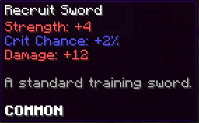
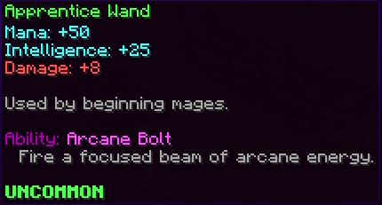



# Items

> **Status:** Working — YAML loader, registry, PDC tagging, lore rendering, equipment stat aggregation, triggered abilities (active + passive + proc), and armor set membership all working. `/rpg item give <id> [player] [amount]` lights up.

Custom items are defined in YAML under `plugins/rpg-core/items/`. Any number of files, any number of items per file.

## Schema

```yaml
testitem: #itemid
  MinecraftItem: stone           # base Material
  Type: MATERIAL                 # SWORD | BOW | WAND | ARMOR | MATERIAL | QUEST | CONSUMABLE | UPGRADE | ACCESSORY
  DisplayName: "&7Test Item"     # optional; defaults to a humanized form of itemid
  Lore:
  - '&7This is some test lore for the first line'
  - '&eThis is some test lore for the second line'
  Rarity: '&7&lCOMMON'           # colored display string
  CustomModelData: 10001         # optional
  Stats:                         # optional; map of stat-id -> number
    damage: 5
    strength: 2
    crit_chance: 5
  Abilities:                     # optional; ability bindings — see trigger syntax below
  - "explode{radius=3,damage_multiplier=1.5}"     # implicit right_click
  - "~on_hit particles{type=HEART,count=3}"       # passive proc — no mana cost by default
  - "~shift_right_click mana_cost{amount=50} aoe{radius=5.0}"
  - "~passive heal{amount=1}"                     # ticking passive
  SetId: my_armor_set            # optional; which set/*.yml this item counts toward
```

### Ability trigger syntax

Every `Abilities:` entry is a **binding**. A binding has a trigger (when it fires) and an effect sequence (what runs). Lines without a `~trigger` prefix default to `right_click` — existing item YAML works unchanged.

| Format | Trigger |
|---|---|
| `"ability_id"` or `"effect{}"` | `right_click` (default) |
| `"~right_click ..."` | Right-click (explicit) |
| `"~left_click ..."` | Left-click |
| `"~shift_right_click ..."` | Sneak + right-click |
| `"~shift_left_click ..."` | Sneak + left-click |
| `"~on_hit ..."` | Player deals damage (melee or projectile) |
| `"~on_hurt ..."` | Player receives damage |
| `"~on_jump ..."` | Player jumps |
| `"~passive ..."` | Ticking — every `abilities.passive-interval-ticks` while held/worn |

Passive and proc triggers do not auto-apply mana cost. Add `mana_cost{amount=N}` at the start of the sequence if you want passive procs to cost mana.

See **[Abilities](abilities.md)** for the full trigger system and effect DSL reference.


## Type-specific blocks

### `CONSUMABLE`

A right-clickable item that applies status effects and is consumed on use.

```yaml
healing_apple:
  MinecraftItem: apple
  Type: CONSUMABLE
  DisplayName: "&dHealing Apple"
  OnConsume:
    Effects:                     # status effects applied on right-click
    - { effect: regen, level: 2, duration: 200 }
    - { effect: strength_boost, level: 1, duration: 100 }
```

### `UPGRADE`

An item that, when applied to another item in the anvil GUI, modifies the target.

```yaml
hot_potato_book:
  MinecraftItem: book
  Type: UPGRADE
  DisplayName: "&6Hot Potato Book"
  Upgrade:
    AppliesTo: [SWORD, BOW, ARMOR]
    MaxStacks: 10                # how many can be applied to one item
    Effect:
      stats:
        strength: 2
        max_health: 4
    LoreAdd: "&7+%stacks% Hot Potato Books"
```

### `ACCESSORY`

Provides stats while in the player's accessory bag. See [addons/accessories.md](../addons/accessories.md).

```yaml
zombie_talisman:
  MinecraftItem: zombie_head
  Type: ACCESSORY
  DisplayName: "&aZombie Talisman"
  Rarity: '&a&lUNCOMMON'
  Stats:
    max_health: 10
  Accessory:
    Family: zombie_talisman      # accessories of the same family don't stack (default behavior)
```

### `ARMOR`

Standard item with optional armor-slot binding. Stats apply while equipped. Passive ability bindings (`~on_hit`, `~on_hurt`, `~on_jump`, `~passive`) fire whenever the item is in an armor slot, not just when held.

```yaml
flame_helmet:
  MinecraftItem: golden_helmet
  Type: ARMOR
  ArmorSlot: HELMET              # HELMET | CHESTPLATE | LEGGINGS | BOOTS
  Stats:
    defense: 25
    max_health: 30
  Abilities:
  - "~on_hurt particles{type=FLAME,count=8}"   # proc when player is hit
  - "~passive heal{amount=1}"                  # 1 HP/sec while wearing
  SetId: flame_set               # optional — links this piece to a set
```

### Armor set pieces

Items with a `SetId:` field count toward an armor set defined in `plugins/rpg-core/sets/`. When enough pieces are worn simultaneously, the set's stat bonuses and passive ability bindings activate. The item lore automatically shows the set name and each tier's bonuses.

```yaml
berserker_helmet:
  MinecraftItem: iron_helmet
  Type: ARMOR
  ArmorSlot: HELMET
  DisplayName: "&cBerserker's Helmet"
  SetId: berserker_set           # references sets/example.yml → berserker_set
  Stats:
    defense: 25
    ferocity: 10
  Rarity: '&5&lEPIC'
```

Lore renders automatically:

```
§6Berserker's Set
  §8(2/4) §f+25 Ferocity §8| §7On Hit
  §8(4/4) §f+75 Ferocity, +50 Damage §8| §7On Hit
```

See **[Armor Sets](../core/armor-sets.md)** for the full set definition schema.

### `SWORD`

```yaml
iron_slayer:
  MinecraftItem: iron_sword
  Type: SWORD
  DisplayName: "&fIron Slayer"
  Rarity: "&f&lCOMMON"
  Stats:
    damage: 40
    strength: 10
    crit_chance: 5
  Abilities:
  - cleave{}                     # inline DSL, or reference a custom ability by ID
```

{ .screenshot }

### `BOW`

Bows consume an ammo item from the player's inventory on each shot. **`AmmoType` must reference a valid item ID** — without it the bow fires for free and any ammo item you defined is never consumed.

```yaml
forest_bow:
  MinecraftItem: bow
  Type: BOW
  DisplayName: "&aForest Bow"
  Rarity: "&a&lUNCOMMON"
  Stats:
    damage: 35
    crit_chance: 8
  AmmoType: iron_arrow           # item ID of the required ammo — must also be defined
  InfiniteAmmo: false            # true = fires without consuming ammo (quiver, ability effect, etc.)
  Abilities:
  - arrow_shot{}                 # ability fires on bow release; projectile{} + damage{} is the typical pattern

iron_arrow:
  MinecraftItem: arrow
  Type: MATERIAL
  DisplayName: "&7Iron Arrow"
  Rarity: "&f&lCOMMON"
```

> The `AmmoType` / ammo item relationship is a two-part wiring: define the ammo item **and** reference it with `AmmoType:` on the bow. Missing either half leaves one end dead.

### `WAND`

Wands scale ability damage with `intelligence` (configurable). The `max_mana` stat (not `mana`) sets the caster's mana pool.

```yaml
apprentice_wand:
  MinecraftItem: blaze_rod
  Type: WAND
  DisplayName: "&aApprentice Wand"
  Rarity: "&a&lUNCOMMON"
  Stats:
    damage: 30
    intelligence: 25
    max_mana: 50                 # ← correct ID; "mana: 50" is silently dropped
  Abilities:
  - arcane_bolt{}
```

Mana cost is enforced by the `mana_cost{}` effect at the top of the ability sequence — **not** by a `ManaCost:` field on the item or ability YAML. See [Abilities](abilities.md).

{ .screenshot }

## Lookup & PDC tagging

When `RpgItem.toItemStack()` produces an `ItemStack`, it embeds the item ID in the item's Persistent Data Container under a fixed key. `ItemRegistry.from(stack)` recovers the item by reading that tag. PDC survives chests, dropped item entities, and server restarts.

## Identifying & sourcing

- Admin: `/rpg item give <id> [player] [amount]` (perm `rpg.core.item.give`)
- In code: `RpgServices.items().get("red_gem")`
- In recipes / loot tables: reference by ID

## Related

- [Abilities](abilities.md) — trigger system, effect DSL, passive/proc reference
- [Armor Sets](../core/armor-sets.md) — set bonus YAML schema
- [Stats reference](../stats.md)
- [Accessories addon](../addons/accessories.md)
- [Resource pack ranges](../resource-pack.md)
