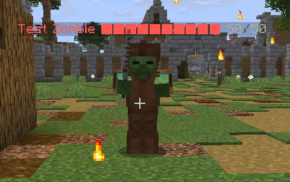



# Mobs

> **Status:** In Progress — Full YAML loader, registry, PDC tagging, equipment, AbilityRegistry-driven ability triggers (`~onTimer` / `~onHit` / `~onHurt` / `~onSpawn` / `~onDeath` all execute), loot tables on death (with damager attribution + magic-find scaling), **and AI profiles (`aggressive`, `passive`, `defensive`, `stationary`)** are all working. Other profile kinds (`ranged_kiter`, `boss`, `swarming`, `pack-hunter`, `flying`) fall back to aggressive for v1 — refined behaviors come in a polish slice. Knockback-immunity flag is enforced via attribute on spawn.

Custom mobs are defined in YAML under `plugins/rpg-core/mobs/`. Any number of files; many mobs per file.

{ .screenshot }

## Schema

```yaml
testmob: #mobid
  MinecraftMob: zombie           # base EntityType
  DisplayName: "&cTest Zombie"   # optional
  Health: 200
  Damage: 5
  Armor: 1
  Boss: false                    # if true, persists across restart with current HP (configurable)
  Immunities: []                 # damage source IDs immune to (e.g., fire, magic, true)
  Stats:                         # optional bonus stat block aggregated like a StatHolder
    crit_chance: 10
    crit_damage: 50
  Equipment:
  - HELMET leather_helmet
  - CHEST leather_tunic
  - LEGS leather_leggings
  - BOOTS leather_boots
  - HAND stone_sword
  Abilities:
  - explode{radius=5,damage_multiplier=0.5} ~onTimer:100  # ability DSL + trigger suffix
  - poison_strike{} ~onHit
  AI:
    profile: aggressive          # aggressive | passive | defensive | ranged_kiter | stationary | boss | swarming | pack-hunter | flying
    aggression-range: 16
    attack-range: 2
    target-priority: nearest     # nearest | lowest-health | highest-threat | random
    leash-range: 32
    leash-action: return         # return | despawn | teleport
    retreat-at-health-percent: 0
    move-speed-multiplier: 1.0
    flees-from: []
    immune-to-knockback: false
  LootTable:                     # inline; alternatively `LootTable: <id>` references loot-tables/
    attribution: weighted-by-damage   # last-hit | top-damager | split-equal | weighted-by-damage
    roll-mode: per-player        # per-player | shared
    coin-drop: { min: 5, max: 20 }
    rolls:
    - { item: red_gem, chance: 5.0, min: 1, max: 1, magic-find-affected: true }
    - { item: zombie_meat, chance: 50.0, min: 1, max: 3 }
    guaranteed:
    - { item: experience_token, min: 1, max: 1 }
  CustomHeadTexture: ""          # optional player-head texture for PLAYER-skinned mobs
```

## Equipment syntax

Each line: `<SLOT> <itemId>`. Slot ∈ `HELMET, CHEST, LEGS, BOOTS, HAND, OFFHAND`. `itemId` resolves via item registry first, vanilla material second.

## Ability triggers

Mob abilities use the same ability DSL as items, with a trailing `~triggerName[:arg]`:

| Trigger | Argument | Fires when |
|---|---|---|
| `~onTimer:<ticks>` | tick interval | Every N ticks while alive |
| `~onHit` | (none) | Mob hits an entity |
| `~onHurt` | (none) | Mob takes damage |
| `~onSpawn` | (none) | Mob spawns |
| `~onDeath` | (none) | Mob dies |
| `~onTargetAcquired` | (none) | Mob picks up a target |

## Ability patterns

The following patterns show common mob ability compositions. These are all live in `mobs/example.yml` and can be spawned with `/rpg mob spawn <id>`.

### Zone denial on spawn

Drop a persistent damage zone the moment the mob spawns. Players who stand in it take damage every interval — forces movement and punishes slow players.

```yaml
frost_golem:
  Abilities:
  - "zone{radius=5.0,duration=600,interval=20,damage=6.0,particle=SNOWFLAKE} ~onSpawn"
  - "freeze{duration=80,amplifier=4} ~onHit"
  - "knockback{force=1.4,up=0.3,direction=away} ~onHurt"
```

Three independent lines: the zone fires once on spawn and persists; freeze applies on every melee hit; knockback retaliates whenever the mob takes damage. Each trigger is independent.

---

### Beam + chain bounce on timer

A fragile mob that fires a ranged chain every few seconds. Good for forcing players to spread out.

```yaml
chain_wraith:
  Abilities:
  - "beam{range=14.0,damage_multiplier=1.0} damage{} chain{count=3,range=8.0,damage_multiplier=0.55} ~onTimer:60"
  - "explode{radius=4.0,damage=18.0,particle=ENCHANT} ~onDeath"
```

`beam{}` sets `ctx.target`. `damage{}` hits the primary target. `chain{}` then bounces from that target to 3 nearby entities. The death line fires one last AoE — leave the room or eat the explosion.

---

### Mark + detonate combo

The mob marks the player on melee hit. A separate timer sequence fires a beam that includes `damage{}` — which automatically detonates any pending mark for a big hit.

```yaml
blood_shade:
  Abilities:
  - "mark{bonus=2.0,duration=200,consume=true} ~onHit"
  - "beam{range=10.0,damage_multiplier=1.3} damage{} ~onTimer:80"
```

Key detail: `mark{}` and `damage{}` run in **separate trigger lines**. The mark applies on hit; the detonation happens when the timer fires its `damage{}`. The player has ~4 seconds to kill the mob before the first detonation.

---

### Boss: shield + slam + launch

Layering three triggers creates a boss that feels reactive and threatening — shields itself when damaged, slams periodically, and launches players on each hit.

```yaml
shield_golem:
  Abilities:
  - "shield{amount=150,duration=120,target=caster} ~onHurt"
  - "aoe{radius=5.0,damage_multiplier=0.7,damage=10.0,particle=CLOUD} ~onTimer:120"
  - "launch{force=1.2,horizontal=0.4,target=target} ~onHit"
```

The shield stacks additively if the mob is hit multiple times before the first shield expires. Burst windows are important — burning it down between shield procs is the intended strategy.

---

### Repositioning + void zone on death

A mobile mob that blinks on a timer and leaves a lingering zone where it dies. Chasing it into tight spaces is dangerous.

```yaml
void_phantom:
  Abilities:
  - "blink{range=10.0,particles=true} ~onTimer:80"
  - "drain{amount=12.0,leech=0.8} ~onHit"
  - "zone{radius=5.0,duration=180,interval=20,damage=10.0,particle=PORTAL} ~onDeath"
```

`blink{}` works on any `LivingEntity` — the mob teleports forward in the direction it's facing. The death zone uses `use_point=false` (default) so it drops at the mob's feet, not an eye-level point.

---

## AI profiles

| Profile | Behavior |
|---|---|
| `aggressive` | Pursues nearest target within aggression range |
| `passive` | Never attacks; flees if hurt |
| `defensive` | Doesn't pursue; counter-attacks if hit |
| `ranged_kiter` | Keeps distance, fires abilities; flees if approached |
| `stationary` | Doesn't move; attacks anything in range |
| `boss` | Use abilities-as-AI (phases driven by HP thresholds — config future) |
| `swarming` | Pursues but doesn't claim a target — multiple swarmers can stack on one player |
| `pack-hunter` | Coordinates with others of the same mob ID (radius config) — they aggro together |
| `flying` | Uses flying movement (no pathfinding to ground) |

Vanilla pathfinding is kept; AI profile only overrides target selection, attack range, leash behavior.

## Spawning

Mobs aren't spawned directly via this YAML. They're spawned by:

- **Admin spawners** ([spawning.md](spawning.md))
- **Natural spawning rules** ([spawning.md](spawning.md))
- **Admin command** `/rpg mob spawn <id>` (perm `rpg.core.mob.spawn`)
- **Custom abilities** that spawn mobs (effect type TBD)

Vanilla mob spawning is cancelled when `vanilla-suppression.mob-spawning: true` in core config.

## Identification

When a custom mob spawns, its ID is written to the entity's PDC. `MobRegistry.from(LivingEntity)` recovers the definition. Vanilla mobs return empty.

## Loot pools

Named, reusable drop tables defined in `loot-pools/*.yml` and referenced by ID. Any mob can share the same pool, and multiple pools stack.

```yaml
# Single pool
testmob:
  LootPool: basic_mob_drops

# Multiple pools — all roll independently on kill
mini_boss:
  LootPools:
    - boss_drops
    - elite_bonus_drops
```

Pools carry `exp:` (vanilla XP orbs) and `combat-exp:` (skill XP) in addition to item and currency drops. Both still work alongside an inline `LootTable:` if present.

**Full docs:** [Loot Pools →](loot-pools.md)

---

## Related

- [Spawning](spawning.md)
- [Loot pools](loot-pools.md)
- [Loot tables](loot-tables.md)
- [Abilities](abilities.md)
- [Vanilla suppression](../core/vanilla-suppression.md)
